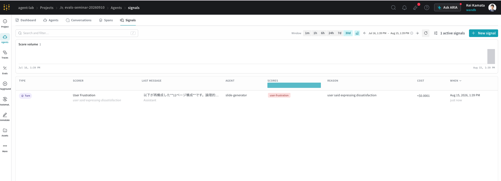

# AI Agent評価体系構築セミナー ハンズオン（2026/9/10）

arXiv論文からスライドを生成するエージェントを題材に、W&B Weaveで評価を実施するハンズオンです。

エージェント本体はTypeScript（deepagents）、評価はPython（W&B Weave）で実装しています。

> [!NOTE]
> Software Design誌「実践LLMアプリケーション開発」の[第32回](https://github.com/mahm/softwaredesign-llm-application/tree/main/32)（エージェント本体と対話UI）および[第36回](https://github.com/mahm/softwaredesign-llm-application/tree/main/36)（評価）のサンプルコードをセミナー用に再構成しています。
> 元のサンプルコードはNode.jsとBunを使用していますが、本リポジトリは受講者がインストールするツールを減らすため、Node.jsのみで動くように変更しています。

## 前提条件

以下を準備してください。

- OpenRouter APIキー（エージェント実行: `deepseek/deepseek-v4-flash`、評価judge: `openai/gpt-5.4`）
- W&B APIキーと自分のW&B entity（Weaveを主題とするため、本ハンズオンでは必須です）
- [Visual Studio Code](docs/setup/install-vscode.md)
- Node.jsと`uv`が使える実行環境（次の方法A・方法Bのどちらかでインストール）

### 方法A: Dev Containerを使う

Visual Studio CodeのDev Containers拡張機能を使い、コンテナ内に開発環境を構築します。コンテナの起動時にNode.jsと`uv`が自動でインストールされます。

1. [Dockerをインストールする](docs/setup/install-docker.md)
2. [Dev Containers拡張機能をインストールする](docs/setup/install-devcontainer.md)

### 方法B: Node.jsとuvを直接インストールする

1. [Node.js](https://nodejs.org/)（v22以上）をインストールします
2. [uv](https://docs.astral.sh/uv/getting-started/installation/)をインストールします

## セットアップ

1. リポジトリをクローンします

```bash
git clone https://github.com/GenerativeAgents/evals-seminar-20260910.git
```

2. Visual Studio Codeでリポジトリを開きます

```bash
cd evals-seminar-20260910
code .
```

> [!NOTE]
> Dev Containerを使用する場合、Visual Studio Codeがリポジトリ内の`.devcontainer/devcontainer.json`を検出し、「Reopen in Container」（コンテナで再度開く）という通知が表示されます。
> 通知をクリックするか、コマンドパレットから「Dev Containers: Reopen in Container」を実行します。
> 初回起動時はコンテナのビルドに数分かかります。完了すると、コンテナ内の開発環境でVisual Studio Codeが開きます。
> Dev Containerを使用する場合、以降のコマンドは、コンテナ内のターミナルで実行してください。

3. 依存関係をインストールします。

```bash
npm install
uv sync
```

4. `.env` を作成し、APIキーを設定します。

```bash
cp .env.sample .env
```

作成した `.env` を開き、各値を自分のキーに書き換えます。

```env
OPENROUTER_API_KEY=your_openrouter_api_key_here
WANDB_API_KEY=your_wandb_api_key_here
WANDB_ENTITY=your_wandb_entity_here
WANDB_PROJECT=evals-seminar-20260910
```

- `OPENROUTER_API_KEY`: エージェント実行と評価judgeの両方で使用（OpenRouter経由でdeepseek-v4-flashとopenai/gpt-5.4を呼び出す）
- `WANDB_API_KEY`: WeaveへのAgent Trace送信と評価の記録に使用
- `WANDB_ENTITY`: Dataset・Evaluation・Traceの記録先となるW&B entity
- `WANDB_PROJECT`: Dataset・Evaluation・Traceの記録先となるW&B project（省略時は `evals-seminar-20260910`）

## Web UIでの動作確認

Next.js + CopilotKitで実装されたWeb UIを起動します。エージェントの動作をブラウザで確認できます。

```bash
npm run dev
```

http://localhost:3000 を開き、チャット欄に次のようにarXiv論文のURLを貼り付けます。

```
https://arxiv.org/abs/1706.03762
```

生成されるスライドの構成案を確認して、次のようにスライドの生成を依頼します。

```
OKです。この構成でスライドを生成してください。
```

スライドが生成され、画面左側にスライドのプレビューが表示されます。

> [!NOTE]
> ヘッダーの「ワークスペース」は、後述する `baseline` / `improvement-1` / `improvement-2` の切り替えです。

### Agent Traceの確認

`WANDB_API_KEY`、`WANDB_ENTITY`、`WANDB_PROJECT`を設定すると、各ユーザー発言を1 Turnとして、モデル呼び出し・ツール呼び出し・SubAgent呼び出しが`${WANDB_ENTITY}/${WANDB_PROJECT}`のWeave Agents画面に記録されます。SubAgentは呼び出し全体のみを記録し、その内部のモデル・ツール呼び出しは記録しません。

UIでスライドが生成されると、PPTX本体もWeaveの`trace_presentation` Callへ自動的に記録されます。CallにはWeave上で確認できるHTMLプレビューも付き、対応するAgent TraceにはCall参照が`trace_presentation`ツール結果として残ります。同じconversation内の同一スライドは1回だけ記録されるため、UIの再描画でCallが重複することはありません。PPTXのダウンロード操作は従来どおり同じconversation IDへ別イベントとして記録されます。

## エージェントの構成

スライド生成エージェントは、指定したワークスペースの`AGENTS.md`と`.agent/skills/`を読み込んで動作します。
ワークスペースは`workspaces/<variant>/`にあり、`<variant>`は次の3つです。

- `baseline`：スキルはワークフローの機構のみ（取得手順・JSON形式・枚数・確認フロー）
- `improvement-1`：スライド設計ガイドを追加（詰め込み禁止・主張型タイトル・論理的な流れ）
- `improvement-2`：保存前の事実確認を追加（本文照合・一般化禁止・照合できない数値は書かない）

### エージェントのCLIでの実行

スライド生成エージェントは次のようにCLIでも実行できます。

```bash
npm run agent -- 1706.03762 baseline # ハンズオンではこのコマンドは実行しません
```

> [!NOTE]
> 上記のコマンドを実行すると、論文URLを渡すターンと、「OKです。この構成でスライドを生成してください。」で生成を承認するターンの2ターンが自動で実行されます。

## オフライン評価のハンズオン

Weaveを使用したオフライン評価を実施します。

### 1. Datasetのpublish

3本の論文（下記「使用論文」）を、自分のprojectへWeave Datasetとしてpublishします。

```bash
uv run eval/publish_dataset.py
```

使用する論文は`eval/dataset.py`に記載されています。

#### 使用論文

- Ashish Vaswani, Noam Shazeer, Niki Parmar, Jakob Uszkoreit, Llion Jones, Aidan N. Gomez, Lukasz Kaiser, Illia Polosukhin. "Attention Is All You Need." NeurIPS 2017. [arXiv:1706.03762](https://arxiv.org/abs/1706.03762)
- Jeremy Yang, Noah Yonack, Kate Zyskowski, Denis Yarats, Johnny Ho, Jerry Ma. "The Adoption and Usage of AI Agents: Early Evidence from Perplexity." 2025. [arXiv:2512.07828](https://arxiv.org/abs/2512.07828)
- Shirley Wu, Evelyn Choi, Arpandeep Khatua, Zhanghan Wang, Joy He-Yueya, Tharindu Cyril Weerasooriya, Wei Wei, Diyi Yang, Jure Leskovec, James Zou. "HumanLM: Simulating Users with State Alignment Beats Response Imitation." 2026. [arXiv:2603.03303](https://arxiv.org/abs/2603.03303)

### 2. オフライン評価（ベースライン）

次のコマンドで、ベースラインでのオフライン評価を実行します。

```bash
uv run eval/run_eval.py baseline
```

`eval/run_eval.py`では、publish済みのDatasetをrefで取得し、3論文それぞれについてエージェントを実行して採点します。評価は`EvaluationLogger`へ`SlideAgentModel(weave.Model)`を渡して記録するため、評価時もAgent modelのversionが追跡されます。

評価指標は次の4つです。

| 評価指標           | scorer               | 実装                                        |
| ------------------ | -------------------- | ------------------------------------------- |
| Tool Correctness   | `tool_correctness`   | 自作function-based scorer（決定的判定）     |
| Summarization      | `summarization`      | プリセット`SummarizationScorer`への移譲     |
| Hallucination Free | `hallucination_free` | プリセット`HallucinationFreeScorer`への移譲 |
| Slide Quality      | `SlideQualityScorer` | 自作class-based scorer（LLM-as-a-judge）    |

scorerは数値だけでなく判定理由も返し、Weave上でDataset・Model・scorerのバージョンとともに記録されます。LLM-as-a-judgeのモデルはlitellm経由の`openrouter/openai/gpt-5.4`です。

### 3. オフライン評価（改善後）

改善を施した`improvement-1`と`improvement-2`のvariantについても、同じコマンドでオフライン評価を実行します。1つの評価に7〜9分かかるため、ターミナルを2つ開いて同時に実行してください。

```bash
uv run eval/run_eval.py improvement-1
```

```bash
uv run eval/run_eval.py improvement-2
```

同じDataset version refと同じscorerバージョンで実行されるため、WeaveのEvals画面で複数のEvaluationを選択してCompareを開くと、variant間で品質軸ごとの変化を行単位まで比較できます。

### 4. Evaluation行からAgent Traceを調査する

各Dataset行の実行時に、`EvaluationLogger.log_prediction()`が発行した`weave.eval.run_id`と`weave.eval.predict_and_score_call_id`をTypeScriptエージェントへ渡します。これらの属性はモデル呼び出し・ツール呼び出し・SubAgent呼び出しを含む全Agent spanへ記録されるため、Evaluation詳細の「View spans」から対応するAgent Traceを直接調査できます。

LLM spanにはOpenRouter応答のinput/output/reasoning/cache token usageを記録し、`gen_ai.usage.total_tokens`とOpenRouterが返す実課金値`openrouter.usage.cost`も保存します。Model出力の`conversation_id`（`<variant>:<thread_id>`形式）はAgents画面のconversation IDにも対応しています。

## Self-improvementへの導入

W&Bは、W&Bに保存された情報をCoding Agentが取得できる[W&B Skills](https://github.com/wandb/skills)・[W&B MCP](https://github.com/wandb/wandb-mcp-server)を提供しています。W&B Skillsのinstallは[こちら](https://github.com/wandb/skills)からできます。

その後、Coding Agentに以下の指示をしてください。Coding Agentが改善を自律的に行う様子が確認できるかと思います。改良するAgentの構成対象や指標を指定することで、精度の高い改善を行うことができます。いきなりloopを回さずにまずは一つずつ改善を積み重ねていきましょう。

```text
$wandb-primary　を使い、Evaluation id: <ご自身のWeaveのEvaluation IDを入力してください。Evaluationの隣のコードをクリックするとコピーができます>
の評価結果を分析してください。
その後 bottle neckを一つ改善し、再度評価を行い、その結果をweaveに保存してください。
なお、修正と実行はworktreeで行ってください
```

## オンライン評価

大量のTraceをすべて人が読むことは現実的ではありません。W&B Weave SignalsはAgentのTurnを評価し、User FrustrationやLow Quality ResponseなどのTag、User SatisfactionやResponse QualityなどのRatingとして可視化するBuilt-inのオンライン評価機能です。Custom Signalも定義できます。さらにAutomationsを設定すると、Monitor metricやTrace activityを条件としてSlack通知やWebhookを実行できます。詳しくは[シグナルを使ってエージェントをモニタリングする](https://docs.wandb.ai/ja/weave/guides/tracking/view-agent-signals)、[カスタムモニターを設定する](https://docs.wandb.ai/ja/weave/guides/evaluation/custom-monitors)、[オートメーションを設定する](https://docs.wandb.ai/ja/weave/guides/evaluation/automations)を参照してください。

W&BのUI上で”User frustration”のSignalsを設定し、再度アプリケーションを起動した後、会話の中で

```text
いえ、内容がよくないです。もっと論理的にわかりやすい構造にしてください
```

などの不満を入れてみてください。WeaveのAgent->SignalsのタブにてUser frustrationのtagがついているかどうか、確認をしてみてください。



## 開発者向け

リポジトリの構成、run workspaceの仕組み、CLIでの実行、評価の内部については[開発者向けガイド](docs/development.md)を参照してください。

## 参考リンク

- [Weave Evaluations overview](https://docs.wandb.ai/weave/guides/core-types/evaluations)
- [Weave Scoring overview](https://docs.wandb.ai/weave/guides/evaluation/scorers)
- [Weave Predefined scorers](https://docs.wandb.ai/weave/guides/evaluation/builtin_scorers)
- [Weave Datasets](https://docs.wandb.ai/weave/guides/core-types/datasets)
- [Weave Compare evaluations](https://docs.wandb.ai/weave/guides/evaluation/compare_evals)
- [W&B Weave Agent Trace](https://docs.wandb.ai/weave/guides/tracking/trace-agents)
- [LangChain JS DeepAgents docs](https://docs.langchain.com/oss/javascript/deepagents/overview)
- [OpenRouter DeepSeek V4 Flash](https://openrouter.ai/deepseek/deepseek-v4-flash)
- [ar5iv](https://ar5iv.labs.arxiv.org/)
